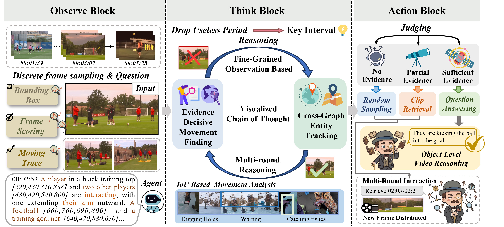

## 🕵️‍♂️ POIROT: Proactive Observation and Interleaved Reasoning On Traces for Video Language Models

[](https://opensource.org/licenses/MIT)
[](https://huggingface.co/datasets) 
[](#)

We introduce POIROT, a novel hierarchical reasoning architecture designed to significantly improve how Vision-Language Models (VLMs) perform multi-step, spatio-temporal logical deduction in complex video tasks.

<p align="center">
  
  <br>
  <em>Figure 1: The Observe-Think-Action workflow.</em>
</p>

## 🌟 Key Features

* **Visualized Chain-of-Thought (V-CoT):**

  Object-Level Discovery: Shifts the paradigm from noise-susceptible, coarse frame-level perception to continuous entity tracking.

  Fine-Grained Anchoring: By outputting precise coordinate traces ([ymin, xmin, ymax, xmax]), the model effectively filters out redundant visual background noise and anchors its logic to physical reality.
* **Observe-Think-Action (O-T-A) Workflow:**
  Formulates video reasoning as a multi-turn, proactive "detective-style" interaction loop.
* **SG-GDPO Reinforcement Learning:**
  A multi-dimensional RL framework based on the GDPO algorithm that integrates dense perceptual rewards:

---

## 📢 News
* **[2026-04-04]** 🚀 Training scripts, evaluation code, and the Dataset have been fully open-sourced.
* **[2026-04-26]** 🎉 **Accepted**: We are thrilled to announce that our paper has been officially accepted!
---

## 🛠️ Installation

```bash
# Clone the repository
git clone https://github.com/anonymous-submission-221/POIROT.git
cd POIROT

# Create a conda environment
conda create -n poirot python=3.10 -y
conda activate poirot

# Install dependencies (requires MS-Swift, vLLM, and standard ML libraries)
pip install ms-swift vllm scipy numpy transformers
